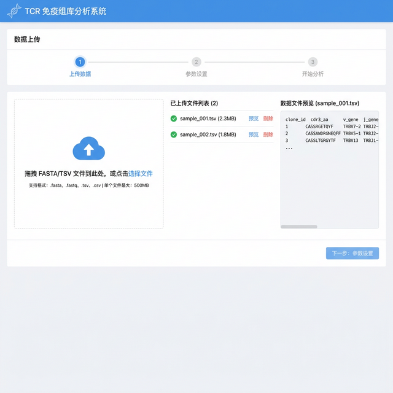
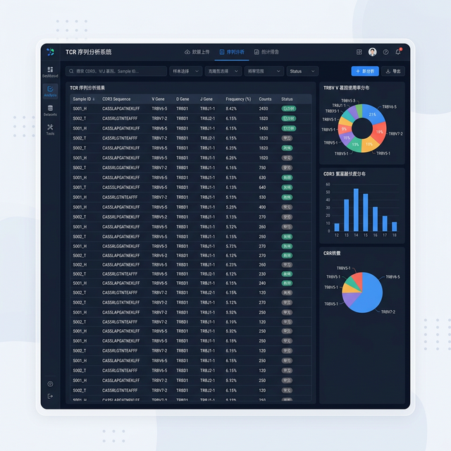
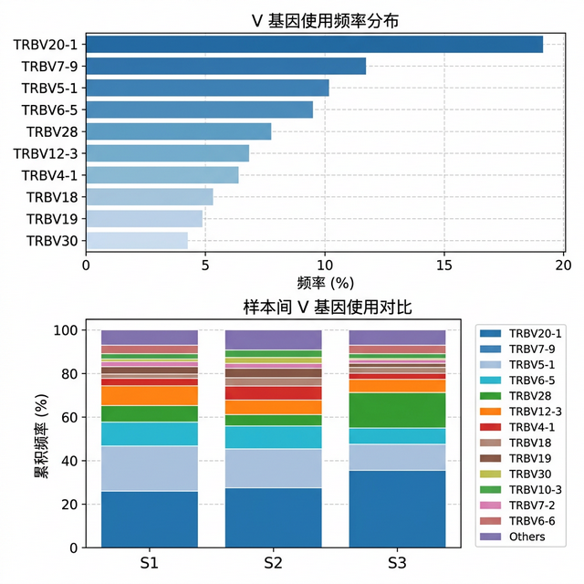
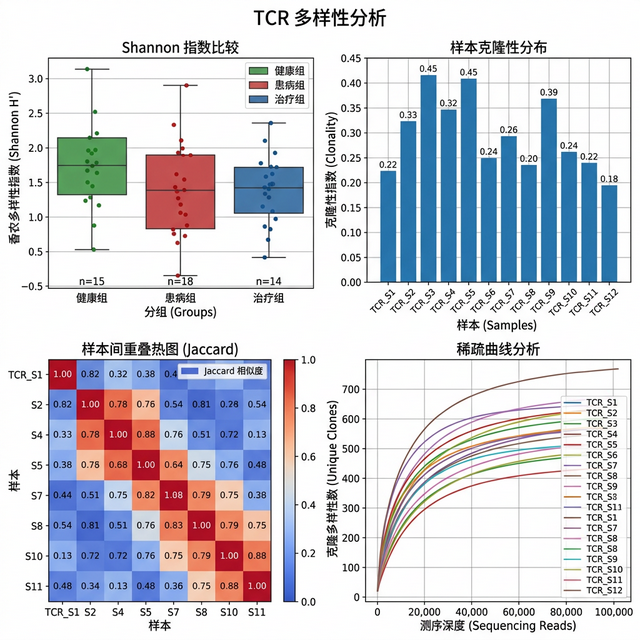
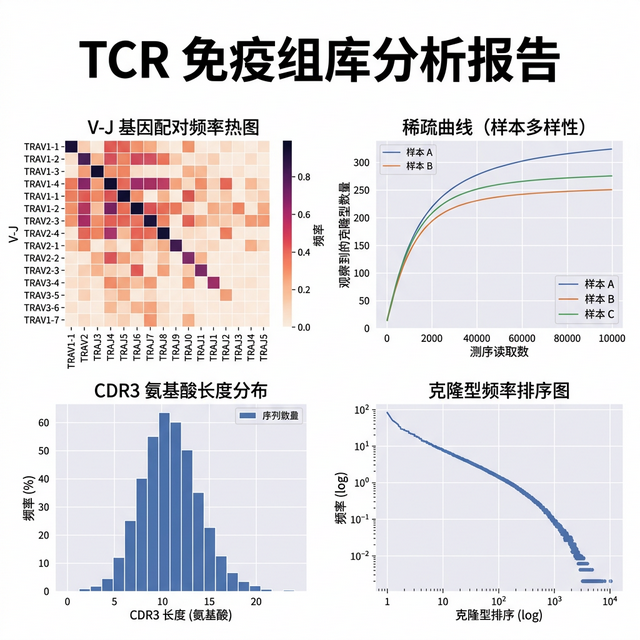

# TCR 免疫组库分析系统

> 基于生物信息学的 T 细胞受体（TCR）免疫组库深度分析平台

## 项目目的

在肿瘤免疫治疗和自身免疫疾病研究中，TCR 组库分析是评估免疫状态的关键手段。传统分析流程依赖 R/Python 脚本，上手门槛高且缺少可视化。本系统将 TCR 分析流程整合为一站式 Web 平台，降低生信分析门槛，让研究人员专注于科学问题本身。

## 解决的痛点

- 传统 TCR 分析需要编写大量脚本，学习成本高
- 样本间对比分析缺少统一框架
- 分析结果缺乏交互式可视化，不利于发现规律
- 多样性指标计算流程繁琐，容易出错

## 系统功能展示

### 数据上传与参数配置

支持 FASTA/TSV 格式文件拖拽上传，自动识别文件格式并预览数据结构。



### 系统分析主界面

集成多维度分析面板，实时展示 TCR 组库关键指标。



### V 基因使用频率分析

自动统计 V 基因使用频率分布，支持多样本间横向对比。



### TCR 多样性综合分析

提供 Shannon 多样性指数、克隆性指数、样本间相似度热图、稀释曲线等指标。



### 分析报告导出

一键生成包含所有分析结果的图表报告，支持 PDF 导出。



## 技术栈

| 层级 | 技术 |
|------|------|
| 前端 | Vue 3 + Element Plus + ECharts |
| 后端 | Python Flask + Celery |
| 分析引擎 | MiXCR + immunarch + tcrdist3 |
| 数据库 | PostgreSQL + Redis |
| 部署 | Docker Compose |

## 核心分析功能

- **CDR3 序列分析**：CDR3 长度分布、氨基酸组成、序列聚类
- **V/J 基因使用**：基因片段使用频率统计与样本间对比
- **克隆多样性**：Shannon 熵、Simpson 指数、Chao1 估计
- **样本对比**：Jaccard 相似度、Morisita-Horn 重叠指数
- **可视化导出**：交互式图表 + PDF 报告一键生成

## 快速开始

```bash
# 克隆项目
git clone https://github.com/xiaofuqing13/TCRSystem.git
cd TCRSystem

# 安装依赖
pip install -r requirements.txt

# 启动服务
python app.py
```

## 项目结构

```
TCRSystem/
├── app.py              # Flask 主入口
├── analysis/           # 分析模块
│   ├── vgene.py        # V基因分析
│   ├── diversity.py    # 多样性计算
│   └── clustering.py   # 序列聚类
├── templates/          # 前端模板
├── static/             # 静态资源
└── docs/               # 文档与截图
```

## 开源协议

MIT License
